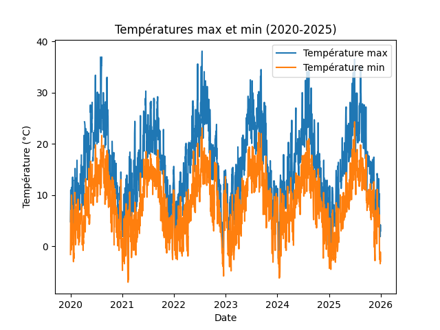
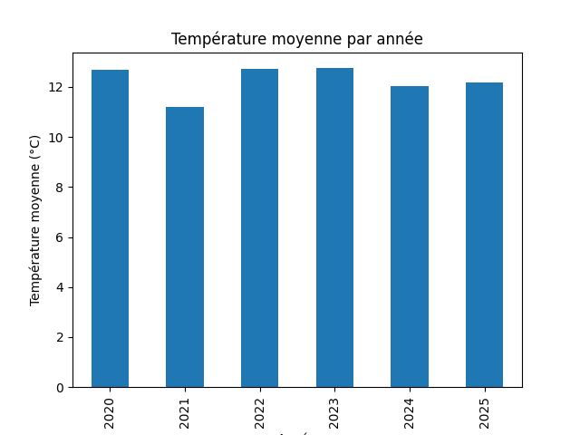
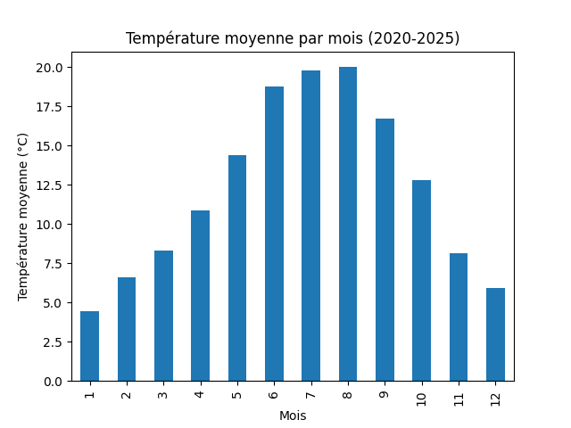
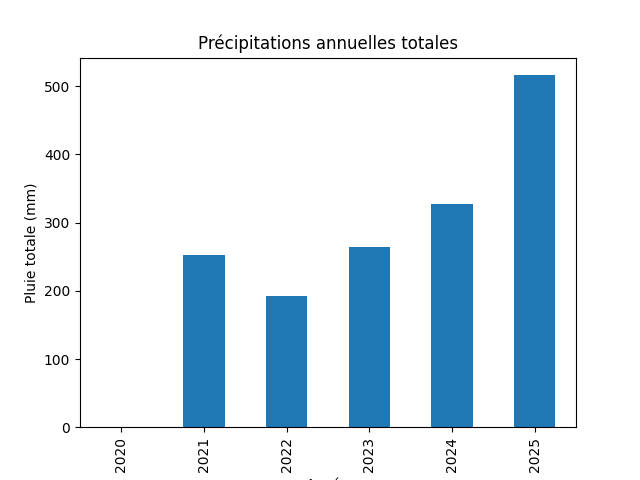
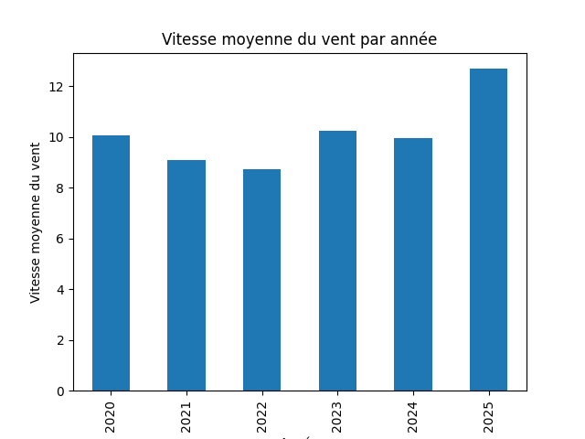

# Analyse Météo Versailles (2020-2025)

## Objectif
Analyser les températures, précipitations et vent à Versailles entre 2020 et 2025 à partir de données quotidiennes.

## Données
- Source : [Meteostat](https://meteostat.net/)
- Station : Trappes (proche Versailles)
- Variables disponibles : 
  - `tavg` : température moyenne quotidienne
  - `tmin` : température minimale quotidienne
  - `tmax` : température maximale quotidienne
  - `prcp` : précipitations quotidiennes
  - `wspd` : vitesse du vent quotidienne
- Remarque : certaines données (ex : précipitations pour 2020) peuvent être manquantes (`NaN`).

## Méthodologie
1. Chargement du fichier CSV `versailles_2020_2025.csv` avec `pandas`.
2. Conversion de la colonne `date` en type datetime.
3. Création des colonnes `year` et `month` pour faciliter l’analyse annuelle et mensuelle.
4. Calcul des moyennes :
   - Température moyenne annuelle
   - Température moyenne mensuelle
   - Précipitations annuelles totales
   - Vitesse moyenne du vent annuelle
5. Détection des extrêmes :
   - Jour le plus chaud (`tmax`)
   - Jour le plus froid (`tmin`)
6. Visualisation avec `matplotlib` :
   - Graphique des températures max/min quotidiennes
   - Graphique de la température moyenne par année
   - Graphique de la température moyenne par mois
   - Graphique des précipitations annuelles
   - Graphique de la vitesse du vent annuelle

## Résultats principaux
### Températures

- La saisonnalité est très claire : hivers froids, étés chauds.  
- Les différences annuelles sont faibles sur la période 2020-2025.  
- Pics de chaleur et de froid visibles et identifiés.

### Précipitations

- Les données pour 2020 sont manquantes.  
- Les autres années montrent la variabilité annuelle.

### Vent

- Les valeurs sont cohérentes et suivent des moyennes annuelles stables.

## Conclusion
Le projet montre la capacité à manipuler un dataset réel, faire des visualisations et analyser des tendances simples.

## Conclusion
Le projet montre une bonne maîtrise :
- Chargement et nettoyage de données réelles
- Calcul de moyennes et détection des extrêmes
- Visualisation efficace des résultats
- Analyse climatologique simple et compréhensible

## Fichiers inclus
- `analyse_meteo.py` : script Python d’analyse et visualisation
- `versailles_2020_2025.csv` : données météo utilisées
- `README.md` : ce fichier
- `Image/` : dossier contenant tous les graphiques
  
